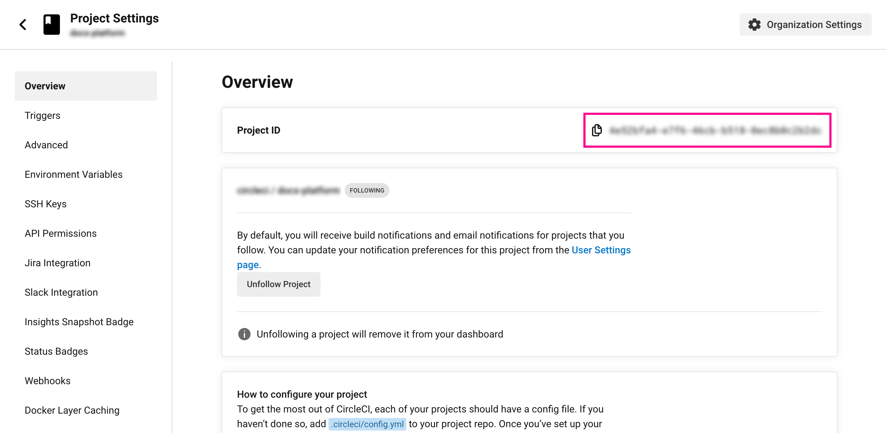

# CircleCI Release Agent Onboarding

This guideline provides instructions on installing the CircleCI release agent. The following subjects are covered:

- Onboarding and deploying Kubernetes workloads via CircleCI or locally.
- Using tools such as the Kubernetes Client, Kustomize, or Helm.
- Using the CircleCI release agent when deployment is not through CircleCI.

> [!NOTE]
> The CircleCI Release Agent is a paid product with a free tier. For pricing details, refer to our [pricing page](https://circleci.com/pricing) or the breakdown explanation provided [here](https://support.circleci.com/hc/en-us/articles/26787303887131-Understanding-CircleCI-s-Releases-Pricing).!

## Table of contents

- [CircleCI Release Agent Onboarding](#circleci-release-agent-onboarding)
  - [Table of contents](#table-of-contents)
  - [Key Terms](#key-terms)
  - [Benefit of using CircleCI Release Agent](#benefit-of-using-circleci-release-agent)
    - [How does the CircleCI Release Agent improve visibility?](#how-does-the-circleci-release-agent-improve-visibility)
    - [How does the CircleCI Release Agent enhance security?](#how-does-the-circleci-release-agent-enhance-security)
    - [How CircleCI and the Release agent can reduce the impact of incidents?](#how-circleci-and-the-release-agent-can-reduce-the-impact-of-incidents)
  - [Install the Release Agent and onboard a component in 4 steps](#install-the-release-agent-and-onboard-a-component-in-4-steps)
    - [Pre-requisites](#pre-requisites)
    - [1. Set up a kubernetes cluster](#1-set-up-a-kubernetes-cluster)
    - [2. Install the CircleCI Release Agent](#2-install-the-circleci-release-agent)
    - [3. Get your CircleCI Project ID](#3-get-your-circleci-project-id)
    - [4. Deploy one of the examples in this repository](#4-deploy-one-of-the-examples-in-this-repository)
    - [Setup is complete!](#setup-is-complete)
  - [Deploy via CircleCI and track every release](#deploy-via-circleci-and-track-every-release)
  - [Debug the Release Agent](#debug-the-release-agent)

## Key Terms

- Component: A component in CircleCI is a collection of code and configuration that is deployed and released as a single unit. In Kubernetes terms, this would be a Deployment or Rollout object along with the related objects such as Pods, ReplicaSets, etc. that share a common circleci.com/project-id annotation and a circleci.com/component-name label.

- Project Id: In the context of this guideline, a Project ID is the unique identifier that maps a Git Repository to a CircleCI project. It is a required field in the Kubernetes workload to allow the Release Agent to accurately track each component's association with a project, ensuring that only authorized individuals can take action on the component.

- CircleCI API Token vs Release Environment Integration Token: The CircleCI API token is utilized for making API calls to the CircleCI public APIs. On the other hand, the Release Environment Integration token is specifically designed for identification and communication between the Release Agent and the CircleCI cloud to monitor releases and components within your environment(s).

- Deploy vs Release: Deployment involves updating a component's version. A Release involves directing traffic to this new version. A Release can occur either as a single step or in a staged manner, such as in a canary or blue green release strategy.

## Benefit of using CircleCI Release Agent

The CircleCI Release Agent provides visibility into releases within your organization, assists in reducing the impact of incidents, and improves your security posture regarding access your developers may require to operate Kubernetes resources.

### How does the CircleCI Release Agent improve visibility?

The CircleCI Release Agent tracks all releases occurring in your Kubernetes cluster, providing visibility into:

- Deployments,
- Historical version changes of each component, and,
- When configured, links each release to its corresponding commit and workflow that produced it

This gives your developers an end-to-end view of the development lifecycle from repository merge to release.

### How does the CircleCI Release Agent enhance security?

Organizations can enhance security through the integration of the CircleCI Release Agent by providing the ability to restrict access to their Kubernetes Cluster, granting permissions only to individuals who require it. This is accomplished through robust controls that are safeguarded by permission checks, ensuring that only authorized users can utilize them. The current available controls are:

- Version restoration (rollback),
- Replica scaling,
- Component restart (for Deployment and Argo Rollouts workloads), and
- Cancel, promote, and retry releases (for Argo Rollouts workloads)

_All of the above controls are available in the CircleCI releases dashboard web UI._

### How CircleCI and the Release agent can reduce the impact of incidents?

The CircleCI Release Agent has demonstrated value both for internal development teams at CircleCI and for external CircleCI customers during incidents:

- Its visibility allows quickly getting a view of what has changed recently within the environment.
- With common in-cluster commands, your team can quickly self-service some key actions, such as restoring the last known good version within your environment - without waiting to find someone with production cluster break-glass access.
- Engineers are equipped with tools to swiftly investigate and rectify incidents. This significantly minimizes the Mean Time To Recover (MTTR), enhancing system uptime and reliability.

## Install the Release Agent and onboard a component in 4 steps

### Pre-requisites

- A CircleCI Environment Integration and Integration Token

  - Create an Environment Integration [here](https://app.circleci.com/releases). Ensure you are in your desired organization for this task.

    - if you are redirected to the home page, select your desired organization and navigate to Releases from the left sidebar navigation menu.

  - After creation, you will land on an onboarding page: `CircleCI Environment Setup: Kubernetes Cluster`.
  - Expand the step `Install CircleCI's Release Agent`.
  - Note down the value of the `tokenSecret.token` from the command in this step in a safe place. This is your Integration Token.

- Access to a Kubernetes Cluster (either local or in the cloud).
- [HELM](https://helm.sh/docs/intro/install/) installed in your machine
- Clone this repository to your machine
- Open a terminal window and navigate to the repository folder

### 1. Set up a kubernetes cluster
If you have one already, you can proceed to step 2. Otherwise, use our local helper script to spin up a local Kubernetes cluster in seconds. This script requires [Docker](https://docs.docker.com/engine/install) and [Kind](https://kind.sigs.k8s.io/docs/user/quick-start) installed on your machine.

- Run in your terminal

```bash
# For Mac/Linux
./scripts/setup_local_cluster.sh setup-local-cluster

# For Windows
powershell -File ".\scripts\setup_local_cluster.ps1" -op "setup-local-cluster"
```

_Our local helper script to start up the cluster has additional options that can be found [here](../docs/onboarding_appendix.md#advanced-local-setup)._

### 2. Install the CircleCI Release Agent

- In the command below, replace `YOUR_CCI_INTEGRATION_TOKEN` with your own Environment Integration token.
- Then, run the command in your terminal

  Mac/Linux

  ```bash
  helm repo add release-agent https://circleci-public.github.io/cci-k8s-release-agent && \
  helm repo update && \
  helm upgrade --install cci-release-agent release-agent/circleci-release-agent \
  --create-namespace \
  --set tokenSecret.token=YOUR_CCI_INTEGRATION_TOKEN \
  --set "managedNamespaces={default}" \
  --namespace circleci-release-agent-system
  ```

  Windows

  ```bash
  helm repo add release-agent https://circleci-public.github.io/cci-k8s-release-agent `
  ; helm repo update `
  ; helm upgrade --install cci-release-agent release-agent/circleci-release-agent `
  --create-namespace `
  --set tokenSecret.token=YOUR_CCI_INTEGRATION_TOKEN `
  --set "managedNamespaces={default}" `
  --namespace circleci-release-agent-system
  ```

_See all options for installing the CircleCI Release Agent [here](https://circleci-public.github.io/cci-k8s-release-agent)._

### 3. Get your CircleCI Project ID

A CircleCI Project ID is required to link your Kubernetes workload to your git repository and CircleCI project. To get your Project ID in CircleCI:

- Go to the [CircleCI Web App](https://app.circleci.com)
- Select your CircleCI organization
- Select Projects in the left sidebar navigation
- Search for the Project you want to link your kubernetes workload to
- On the Project, click on the '...' more options button on the right side, and select Project Settings
- Copy the project ID from the `Project settings` in the top right



_If you prefer to get the Project ID programatically check [this](../docs/onboarding_appendix.md#obtain-the-circleci-project-id-programmatically)._

### 4. Deploy one of the examples in this repository

Use the command below to replace placeholders in the example Kubernetes manifest provided [here](../examples/k8s_cli/k8s_deployment/)

- Update the command to use your `Project ID` from CircleCI. Replace `USE-REAL-PROJECT-ID` with your own from the [previous step](#3-get-your-circleci-project-id).

- Then, run the command in your terminal (_if you have `envsubst` available in your terminal and do not want to use docker follow [this alternative](../docs/onboarding_appendix.md#use-the-terminal-to-replace-the-manifests-placeholders))_.

    Mac/Linux

    ```bash
    docker run -e CIRCLE_PROJECT_ID="USE-REAL-PROJECT-ID" -e VERSION=$(cat version) -e TAG="green" \
    -v $(PWD)/examples/k8s_cli/k8s_deployment:/manifests --rm alpine:latest /bin/sh -c "apk add --no-cache gettext && \
    rm -f /manifests/manifest-rendered.yaml
    envsubst < /manifests/deployment.yaml >> /manifests/manifest-rendered.yaml && echo "---" >>  /manifests/manifest-rendered.yaml && \
    envsubst < /manifests/service.yaml >> /manifests/manifest-rendered.yaml && echo "---" >>  /manifests/manifest-rendered.yaml && \
    envsubst < /manifests/ingress.yaml >> /manifests/manifest-rendered.yaml \
    "
    ```

    Windows

    ```bash
    docker run -e CIRCLE_PROJECT_ID="USE-REAL-PROJECT-ID" -e VERSION=$(Get-Content -Path version) -e TAG="green" `
    -v ${PWD}/examples/k8s_cli/k8s_deployment:/manifests --rm alpine:latest /bin/sh -c "apk add --no-cache gettext && \
    rm -f /manifests/manifest-rendered.yaml
    envsubst < /manifests/deployment.yaml >> /manifests/manifest-rendered.yaml && echo "---" >>  /manifests/manifest-rendered.yaml && \
    envsubst < /manifests/service.yaml >> /manifests/manifest-rendered.yaml && echo "---" >>  /manifests/manifest-rendered.yaml && \
    envsubst < /manifests/ingress.yaml >> /manifests/manifest-rendered.yaml \
    "
    ```

- Next, complete a deploy by running the following command in your terminal

    ```bash
    kubectl apply --namespace default -f ./examples/k8s_cli/k8s_deployment/manifest-rendered.yaml
    ```

### Setup is complete!

- View the CircleCI [Releases Dashboard](https://app.circleci.com/releases) to see the release created by the Release Agent.
- To simulate the release process of a component, update the [version file](../version) in this repository and repeat all commands in [step 4](#4-deploy-one-of-the-examples-in-this-repository)
- Once you are done with your local cluster, clean up everything by running

  ```bash
  # For Mac/Linux
  ./scripts/setup_local_cluster.sh destroy-local-cluster

  # For Windows
  powershell -File ".\scripts\setup_local_cluster.ps1" -op "destroy-local-cluster"
  ```

## Deploy via CircleCI and track every release

If you are interested in how to build and deploy your application in an automated fashion using within CircleCI while tracking every release in your system, review the following guidelines:

Note: remember that you need a kubernetes cluster accessible from the internet to install the [Release Agent](https://circleci-public.github.io/cci-k8s-release-agent)

- [Deploy a Deployment workload using Kubectl](../docs/cci_deploy/deployment_kubectl.md)
- [Deploy an Argo Rollouts workload using Kubectl](../docs/cci_deploy/rollout_kubectl.md)
- [Deploy a Deployment workload using kustomize](../docs/cci_deploy/deployment_kustomize.md)
- [Deploy an Argo Rollouts Workload using kustomize](../docs/cci_deploy/rollout_kustomize.md)
- [Deploy a Deployment workload using Helm](../docs/cci_deploy/deployment_helm.md)
- [Deploy a Argo Rollouts Workload using Helm](../docs/cci_deploy/rollout_helm.md)

If you use CircleCI as your CI platform but your deployments are managed outside CircleCI you can still benefit from the release agent. To know more check [here](../docs/onboarding_appendix.md#using-the-release-agent-when-deploying-outside-circleci).

## Debug the Release Agent

- Change the log level `kubectl patch configmap cci-release-agent-circleci-release-agent -n circleci-release-agent-system  -p '{"data": {"LOG_LEVEL": "DEBUG"}}'` the default level is ERROR.

- Restart the agent `kubectl rollout restart deployment cci-release-agent-circleci-release-agent -n circleci-release-agent-system`

- Deploy a kubernetes workload in one of the managed namespaces by the Release Agent

- Check the agent logs `kubectl logs {pod_name} -n circleci-release-agent-system`. There are usually 2 pods but there is only one running at the time, check the appropriate pod to inspect the logs.

- If you still have issues feel free to contact the CircleCI support team [here](https://support.circleci.com/hc/en-us).

- Or bring your questions to our [Discuss Forum](https://discuss.circleci.com/) or [Discord](https://discord.gg/circleci).
